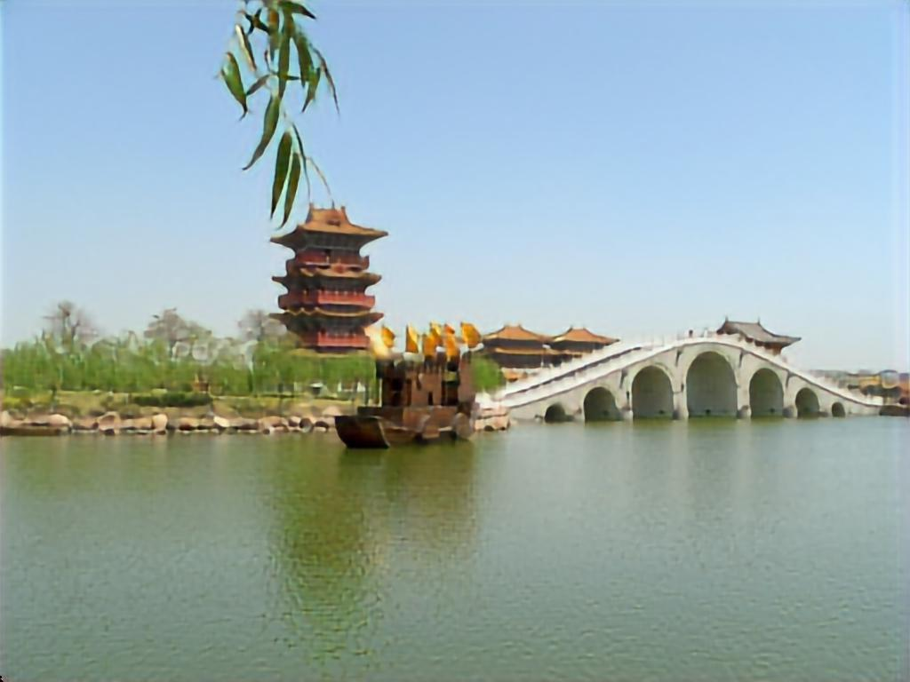
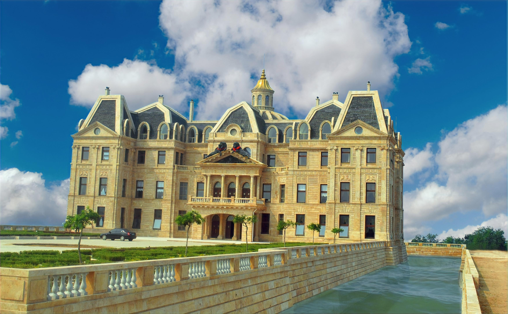
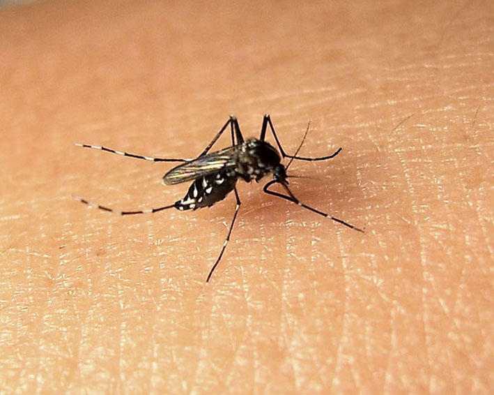
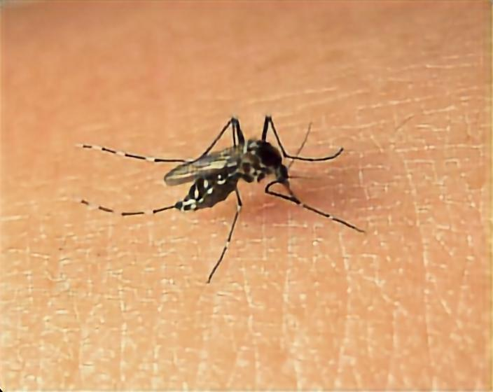

# ImageAutoEncoder

Just a image autoEncoder

说明：

    1. 训练一共采用了10w张左右图片
    2. 会有部分色彩失真
    3. 训练过程图片resize=[224,224]
    4. 采用更大分辨率训练可能会提高还原质量

注意： 

    1. 此网络无法实现无损压缩
    2. 还原后的图片尺寸为int(size/8)*8
    3. 欢迎各位提交更好的权重
    
input/output效果如下

    
    
    
    
    